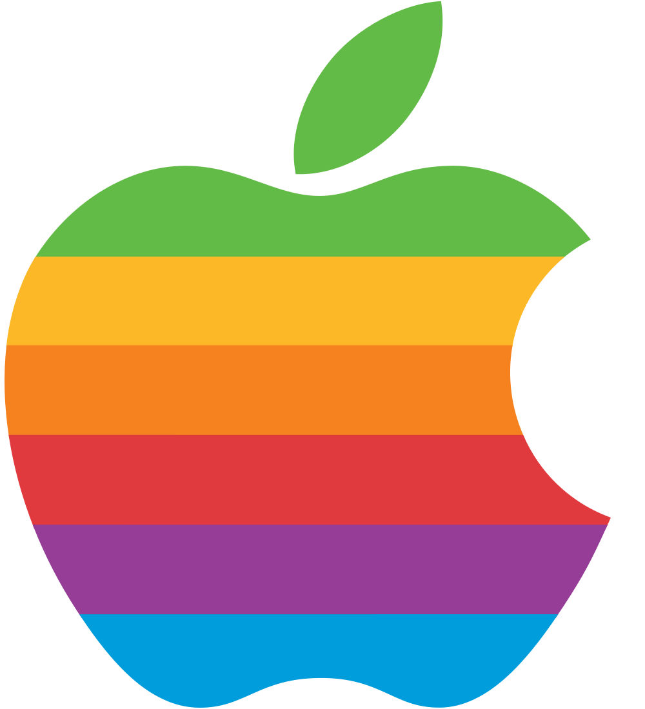

# Apple Logo Screensaver
Basic screensaver that displays the vintage rainbow Apple logo against a black background.
The logo jumps to a new random position on the screen every 10 seconds.



## Build

1. Open the project in XCode and click "Build"

## Install

1. Double-click the `AppleLogo.saver` file
2. You should be prompted to install the screensaver

## Customization

### Size of logo (relative to screen size)

Change the line:

```objective-c
static const float kLogoScale = 0.2;  // fraction of the screen to occupy
```

### Interval to change position of logo

Change the line:

```objective-c
        [self setAnimationTimeInterval:10.0];
```

`setAnimationTimeInterval` is in seconds.
